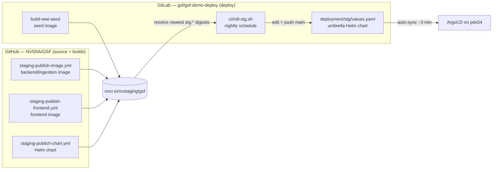

# Deploying GSF on Kubernetes

## Deployment From NVStaging

1. Fetch the chart from NGC:

   ```bash
   helm fetch https://helm.ngc.nvidia.com/nvstaging/gsf/charts/gsf-0.0.1.tgz \
     --username='$oauthtoken' \
     --password=<API-KEY>
   ```

2. Create the nvcr.io image-pull secret:

   ```bash
   kubectl create secret docker-registry nvcr-creds \
     --docker-server=nvcr.io \
     --docker-username='$oauthtoken' \
     --docker-password=<API-KEY>
   ```

3. Attach the pull secret to the default ServiceAccount so pods inherit it:

   ```bash
   kubectl patch serviceaccount default \
     -p '{"imagePullSecrets":[{"name":"nvcr-creds"}]}'
   ```

4. Install the chart:

   ```bash
   helm install gsf gsf-0.0.1.tgz \
     --set nvidiaApiKey=<API-KEY> \
     --set neo4jPassword=<NEO4J-PASSWORD> \
     --set postgresPassword=<POSTGRES-PASSWORD> \
     --set connectionStrings=<CONNECTION-STRINGS>
   ```

5. Expose the UI:

   ```bash
   kubectl port-forward frontend 3000:3000
   ```

## Staging / Astra nightly deployment

The live staging demo on Astra (cluster `astrastg01-ocp-pdx04`, namespace
`ns-gsf-demo-deploy`) is GitOps-driven. GitHub and GitLab are **decoupled** and
meet only at the nvcr.io registry:



### How images are built (all on push, to nvcr.io)

| Image | Built by | Repo / tag |
|---|---|---|
| Backend + ingestion | GitHub `staging-publish-image.yml` | `nvcr.io/nvstaging/gsf/gsf:stg.<ts>` |
| Frontend (Next.js) | GitHub `staging-publish-frontend.yml` | `nvcr.io/nvstaging/gsf/gsf-frontend:stg.<ts>` |
| WWI demo-data seed | GitLab `build-wwi-seed` | `nvcr.io/nvstaging/gsf/gsf-wwi-seed:latest` |

CI validation (`ci-client.yml` runs `pnpm build`) only checks the frontend
compiles — it does **not** publish an image. Production frontend images come
from `staging-publish-frontend.yml` (or, ad hoc, `make publish-frontend`).

### The nightly roll (`roll-stg`)

Lives in the **deploy repo** at `ci/roll-stg.sh` and runs as a GitLab CI job on
a pipeline **schedule** (see that repo's README for the exact schedule + CI
variables). Each night it:

1. Resolves the newest `stg.*` backend and frontend images on nvcr.io + digests.
2. Refreshes the WWI seed digest.
3. Re-pins those in `deployment/stg/values.yaml` and bumps `gsf.podAnnotations.rolledAt`.
4. Commits and pushes to `main` (with `-o ci.skip` so the bot commit starts no
   pipeline). ArgoCD auto-syncs within ~3 min — the app redeploys on the newest
   images and the WWI reset → seed → ingest hooks re-run.

It **builds nothing**; it only re-pins images that already exist on nvcr.io.

### Why the Helm chart is published separately (not "nightly")

The staging deployment **is** Helm-based: the deploy repo holds an umbrella Helm
chart that consumes the portable `gsf` chart (`helm/gsf/`) as an OCI dependency,
and ArgoCD renders/applies it. Two separate lifecycles, deliberately:

- **Chart publish** (`staging-publish-chart.yml`) runs only when the chart
  *structure* changes (push under `helm/gsf/**`) or manually — never on a timer.
- **Nightly roll** (`roll-stg`) never touches the chart; it only edits the image
  pointers *inside* the chart's values.

So `roll-stg` does use Helm — indirectly, via the values ArgoCD renders — and the
chart is not published nightly.