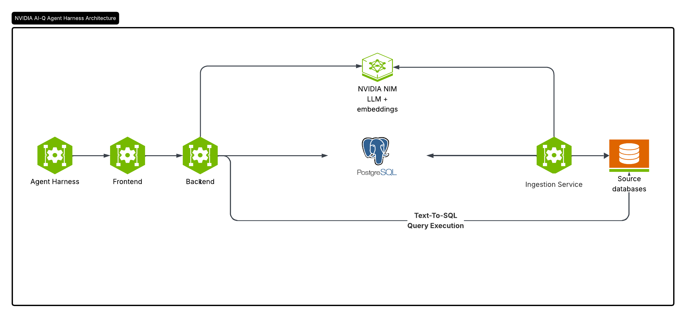

# GSF

Generative Semantic Fabric adds the structured-data ontology layer to any partner or NVidia agent harness  interface, like NVIDIA AI-Q Claws, etc

> **Licensing & contributions.** GSF is distributed under the
> [Apache License 2.0](./LICENSE). Third-party open-source components
> bundled, linked, or otherwise used by this project are listed in
> [`THIRD_PARTY_NOTICES.md`](./THIRD_PARTY_NOTICES.md). **This project
> is currently not accepting external contributions.**

<p>

</p>

## Key Features

- **Natural-language querying** of structured data — questions are translated to
  SQL and executed against connected databases, powered by NVIDIA NIM.
- **Semantic catalog / ontology layer** over relational sources, stored as a
  graph in Neo4j.
- **Authentication & RBAC** —using [Better Auth](https://github.com/better-auth/better-auth).
- **Web UI** for chat, analysis, data catalog, analytics, and settings.
- **Flexible deployment** — Helm chart for Kubernetes or Docker Compose for a
  local stack.

## Software Components

| Component | Technology | Role | Default port |
|---|---|---|---|
| Frontend | Next.js 16 (React 19, TypeScript, Tailwind CSS 4), Better Auth, Prisma | Web UI, authentication, API gateway | 3000 |
| Backend | FastAPI (Python 3.12+), NeMo-Retriever, LangChain | Chat / NL-to-SQL, catalog, datasource APIs | 3001 |
| Ingestion worker | FastAPI (Python 3.12+), NeMo-Retriever | Ingests tabular data and writes embeddings | 3002 |
| Postgres + pgvector | Relational Database | App metadata and vector store | 5432 |
| Neo4j | Graph Database | Ontology graph | 7474 / 7687 |
| HashiCorp Vault | Optional | Secure storage of connection credentials | — |

### NVIDIA NIM

GSF uses NVIDIA NIM endpoints for inference — either the hosted endpoints on
[build.nvidia.com](https://build.nvidia.com) or self-hosted NIMs:

- **LLM:**
  [nemotron-3-nano-30b-a3b](https://build.nvidia.com/nvidia/nemotron-3-nano-30b-a3b/modelcard)
- **Embeddings:**
  [llama-nemotron-embed-vl-1b-v2](https://build.nvidia.com/nvidia/llama-nemotron-embed-vl-1b-v2)

The endpoints and models are configured via the `BASE_URL`, `MODEL_NAME`,
`EMBED_ENDPOINT`, and `EMBED_MODEL` environment variables and require an
`NVIDIA_API_KEY`.

## Deployment

### Prerequisites

- An **NVIDIA API key** for NVIDIA NIM (chat and ingestion). Get one at
  <https://build.nvidia.com>.
- Connection details for the source database(s) you want to query
  (Postgres, Snowflake, or DuckDB).

### Installation

**Kubernetes**

To deploy GSF on a Kubernetes cluster, see [`DEPLOYMENT.md`](./DEPLOYMENT.md).

**Local (Docker Compose)**

1. Clone the repository:

   ```bash
   git clone <repo-url> gsf && cd gsf
   ```

2. Create your environment file (.env) from the template and fill in the values
   (Postgres/Neo4j credentials, `NVIDIA_API_KEY`, `CONNECTION_STRINGS`, etc.).
   See [`.env.example`](./.env.example) for the full list of variables:

   ```bash
   cp .env.example .env
   # edit .env
   ```

3. Build the images and start the stack:

   ```bash
   docker compose up -d --build
   ```

   This builds the backend (`gsf`) and frontend (`gsf-frontend`) images, brings
   up Postgres, Neo4j, and pgAdmin, runs the one-shot `frontend-migrate` job to
   sync the database schema, and starts the app.

4. Open the UI at <http://localhost:3000> (the backend API is on `:3001`,
   pgAdmin on `:5050`).

## Connections Management

GSF resolves the source databases it connects to from two sources:

1. **Added through the UI** — connections created from within the app. With this
   option the connection credentials are **stored in plaintext in Neo4j unless
   Vault is configured**:
   - **Without Vault:** the full connection object (including the password) is
     JSON-serialized and stored, unencrypted, on the database's Neo4j node.
   - **With Vault:** the credentials are written to Vault, keyed by the database
     name, and the Neo4j node stores no credentials (the database name is the
     lookup key — there is no separate reference field).

   Vault is enabled only when all of `VAULT_ADDR`, `VAULT_NAMESPACE`,
   `VAULT_ROLE_ID`, and `VAULT_SECRET_ID` are set (`VAULT_AUTH_MOUNT` and
   `VAULT_KV_MOUNT` are optional overrides). It is off by default; a partial
   configuration is ignored with a warning and falls back to plaintext storage.

2. **`CONNECTION_STRINGS` environment variable** — a comma-separated list of
   connection strings supplied at deploy time (e.g. the Helm
   `--set connectionStrings=<CONNECTION-STRINGS>` flag). This is a fallback: it
   is used only when there are no UI-added connections.

## Authentication

GSF Supports SSO for authentication.
The Redirect URI should be configured in the IdP as: APP_URL/api/auth/sso/callback

## License

GSF is licensed under the [Apache License, Version 2.0](./LICENSE).
SPDX identifier: `Apache-2.0`.

Each NVIDIA-authored source file in this repository carries an SPDX header
of the form:

```text
SPDX-FileCopyrightText: Copyright (c) 2024-2026, NVIDIA CORPORATION & AFFILIATES.
All rights reserved.
SPDX-License-Identifier: Apache-2.0
```

Third-party open-source components used by GSF are enumerated, with their
upstream licenses and project URLs, in
[`THIRD_PARTY_NOTICES.md`](./THIRD_PARTY_NOTICES.md).

## Contributing

**This project is currently not accepting contributions.** Issues, pull
requests, and patches submitted from outside the GSF maintainer team will
not be reviewed or merged. Security-relevant reports should follow the
process described in [`SECURITY.md`](./SECURITY.md).
